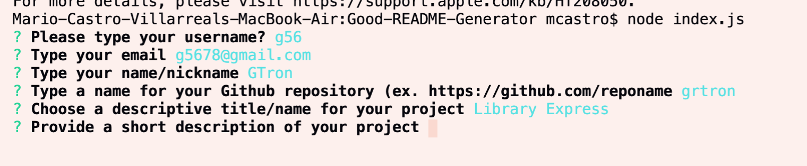
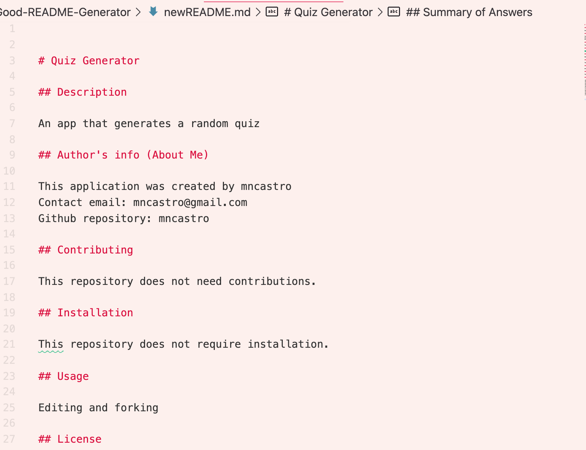

# Professional README-Markdown Generator

This is a Node command-line application that dynamically generates a professional README.md file based on user's input.

The application and the final README file template is based on the guidelines suggested by Cornell University: [Good README Guide](https://data.research.cornell.edu/content/readme). 

The application will generate a final Markdown(.md) file with the following template/structure:

*Title
*Description
*Author's Info (About Me/Us)
*Contributing
*Installation
*Usage
*License
*Support
*Credits and Acknowledgements
*Summary of Questions and Answers

## Functionality

-The application asks the user a series of prompt regarding their repository and project. 

-After inserting the info, the application sends the answers to an output Markdown file that lists a summary of the answers. 

-The user can then edit the .md file and add additional information or assets. 

## Libraries and Dependencies Used in the Current Version of This Application

-The application uses the
[Inquirer npm package](https://github.com/SBoudrias/Inquirer.js/) and the Node CLI.

### Future Development and Fixes

-Create an exit menu.

-Add additional prompts and generate URLs automatically. 

## Video and Pictures Showcasing Current Funcionalities

## [Link to .MOV video showcasing functionalities](https://drive.google.com/file/d/1tj_2QJRXW8-9o7Hpm5qA8HXRn0-PZsaR/view?usp=sharing)

-Screenshot showing application's functionalities.
-Video sampling the application and CLI tests.

